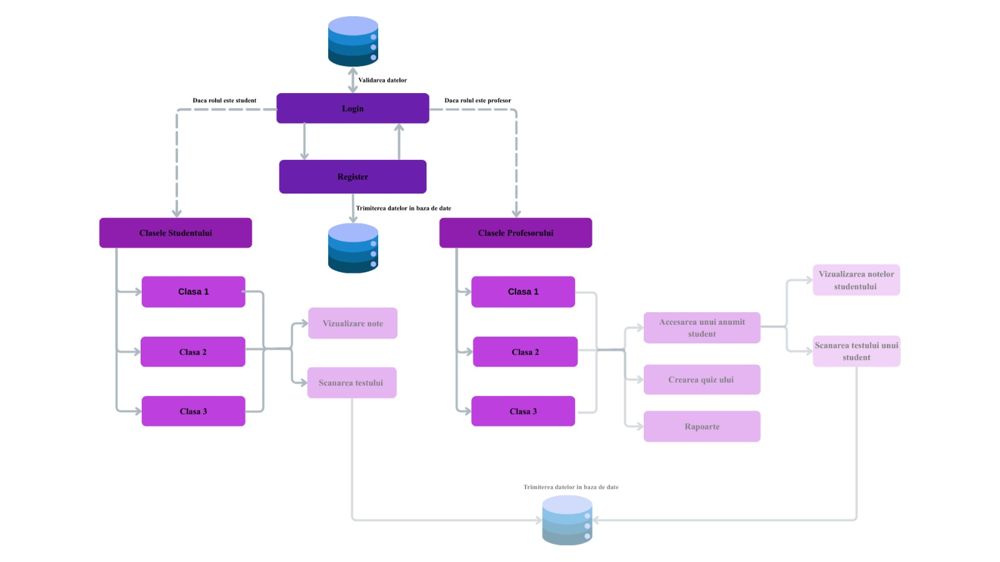

# 💡 **Smart-Quiz**
## ▪ Scopul aplicației 
Aplicația Smart Quiz are scopul de a eficientiza procesul de corectare al testelor de tip grilă. Acesta permite atât profesorilor cât și studenților să scaneze quiz-ul și să primească rezultatul. În cadrul aplicației există două tipuri de conturi: unul cu rol de student și unul cu rol de profesor. Profesorii pot crea clase, fiecare având un cod unic de identificare, pot crea test si vizualiza notele elevilor. Studenții pot să se alăture unei clase folosind codul clasei și pot să vizualizeze calendarul testelor care urmează. 
## ▪ Publicul țintă și funcționalitățile 
Publicul țintă este format din profesori, care au nevoie de cel mai scurt timp pentru corectare și studenți, care așteaptă rezultatul rapid, imediat după închiderea sesiunii de scanare. Funcționalitățile implementate se axează pe rezolvarea acestor nevoi: oferim corectarea automată a quiz-urilor cu număr personalizat de întrebări și integrăm scanarea făcută de student direct în sistem, iar nota si lucrarea vor fii trimise direct către profesor pentru a evita posibilele fraude.

## Funcționalități implementate 
- Navigarea eficientă între paginile aplicației
- Folosirea bazei de date pentru salvarea utilizatorilor și efectuarea login ului 
- Crearea de noi clase în cadrul paginii Classes atunci când contul conectat este unul de profesor
- Posibilitatea de a intra intr-o clasa creata atunci cand contul conectat este unul de student
- Adaugarea de review uri în cadrul paginii Feedback
- Scanarea testelor cu ajutorul camerei
- Vizualizarea notelor de catre profesor cat si de student

## Tehnologii folosite 
- pentru partea de frontend : CSS , HTML, JAVASCRIPT
- pentru partea de backend : DJANGO, JAVASCRIPT
- baza de date folosită este : SQLite

## ▪ Concurența 
Am analizat piața și am identificat punctele slabe ale concurenței. ZipGrade permite doar profesorului să scaneze lucrările și impune un număr limitat de scanări, iar Google Forms nu permite crearea de clase și managementul centralizat. Elementul nostru de unicitate care ne diferențiază clar este funcționalitatea de auto-scanare, adică fiecare student își poate scana singur lucrarea, mutând sarcina de la profesor la elev. În plus, aplicația noastră suportă un număr personalizat de întrebări și oferă roluri dedicate de Student și Profesor, asigurând o gestionare ușoara a claselor si a rezultatelor.

## ▪ Arhitectură și Fezabilitate
Structura inițială a aplicației include pagini de Autentificare/Înregistrare și Dashboard-uri separate. Rolul de Profesor gestioneaza crearea de Quiz-uri, Managementul Claselor și Raportarea Rezultatelor. Rolul de Student acceseaza funcționalitatea centrală de Scanare, și Vizualizare Note. Fezabilitatea tehnică este asigurată prin utilizarea unei tehnologii de recunoaștere a imaginii pentru decodificarea foilor de examen, stocarea datelor într-o bază de date securizată și dezvoltarea unei interfețe intuitive.

## ▪ Membrii echipei 
Echipa este alcătuită din Ciucheș Cristina, Ciocan Daniel și Corb Alexia  
## Instrucțiuni de rulare al aplicației
- clonarea proiectului local
  ```bash
  git clone https://github.com/alexiacorb/Smart-Quiz.git
  ```
- deschiderea proiectului in editorul de cod preferat (exemplu Visual Studio Code)
- navigarea în folderul proiectului
  ```bash
  cd SmartQuiz
  ```
  instalare dependencies
  ```bash
  pip install django-pwa
  pip install opencv-python
  ```
- realizarea migrărilor pentru baza de date
  ```bash
  python manage.py makemigrations 
  python manage.py migrate
  ```
- pentru rularea aplicatiei este necesara rularea comenzii care porneste serverul
  ```bash
  python manage.py runserver
  ```
- accesarea link ului primit în terminal
  http://127.0.0.1:8000/
## Diagrama de arhitectură 


